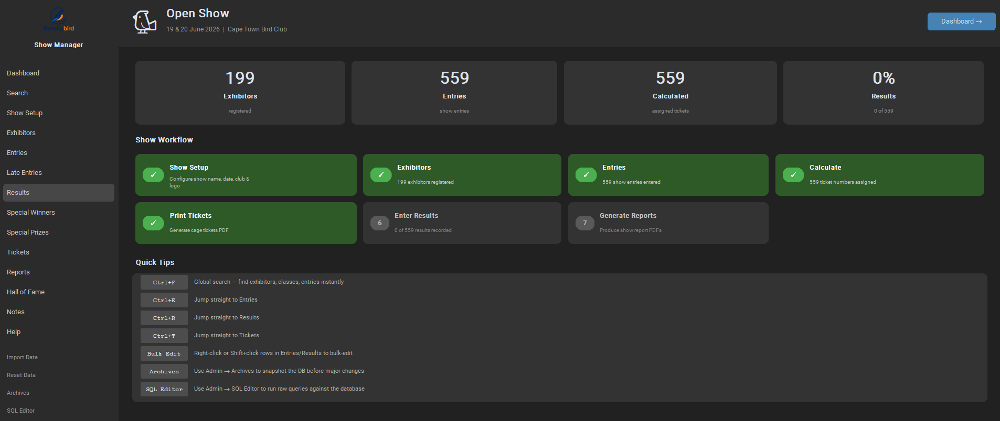

# Benchabird Show Manager

A standalone Windows desktop application for managing cage-bird shows. Replaces a legacy Microsoft Access system with a modern, offline-first Python app — no network connection, no server, no installation required.

<p align="center">
  
</p>

---

## Table of Contents

- [Features](#features)
- [Quick Start](#quick-start)
- [Show Workflow](#show-workflow)
- [User Guide](#user-guide)
- [Reports Reference](#reports-reference)
- [Keyboard Shortcuts](#keyboard-shortcuts)
- [Development Setup](#development-setup)
- [Project Layout](#project-layout)
- [Building the Executable](#building-the-executable)
- [Tech Stack](#tech-stack)

---

## Features

### Core Show Management

| Section | Description |
|---|---|
| **Dashboard** | Live snapshot of show progress: entry count, result coverage, workflow status checklist, top exhibitors bar chart, quick-navigation buttons |
| **Show Setup** | Show name, date, club details in English and Afrikaans. Upload club logo — stored in the database and applied as a watermark on all PDFs |
| **Search** | Global search across exhibitors, entries, results, and special winners. Per-view filter bars on every table |
| **Exhibitors** | Full CRUD with live search. Toggle address-label inclusion per exhibitor. Export filtered list to CSV or Excel |
| **Entries** | Raw and calculated entry views. Add individually, bulk-add by exhibitor, bulk rename classes, bulk delete or reassign. Export to CSV or Excel |
| **Late Entries** | Separate tracking for post-deadline entries |
| **Calculate** | Assigns sequential ticket numbers to all entries. Run after adding entries, before printing tickets |
| **Results** | Rapid-entry mode: Enter key chains exhibit number → result dropdown → save. Mark Not Benched. Export to CSV or Excel |
| **Special Winners** | Assign special prize winners by exhibit number |
| **Special Prizes** | Manage the prize list: description, trophy type, cash amounts |
| **Tickets** | Preview and print cage tickets as PDF. Each ticket has exhibit #, class, exhibitor name, QR code, and club logo watermark |
| **Reports** | 7 PDF reports with in-app preview, page navigation, Print button, and Save As |
| **Hall of Fame** | Historical champion records (read-only) |
| **Notes** | Brochure text per bird type |
| **Archives** | Named database snapshots — save before a reset, restore any previous show state |
| **SQL Editor** | Direct SQL access for advanced users — up to 500 rows, write queries require confirmation |

### PDF Features

- **Club logo watermark** on every report page and ticket page (faded, centered — no text overlap)
- **In-app PDF preview** with page navigation before committing to print
- **Print button** — sends to OS print dialog directly from the preview window
- **Save As** — saves the PDF to any location; opens automatically on Windows

---

## Quick Start

### Option A — Prebuilt Executable (Recommended)

1. Download `benchabird.exe` from the `dist/` folder or release page
2. Double-click to run — no Python or installation required
3. On first run the app creates `benchabird.db` in the same folder as the exe

> Keep `benchabird.exe` and `benchabird.db` in the same folder. Moving only the exe will cause a fresh database to be created.

### Option B — Run from Source

```bash
cd benchabird_app
pip install -r requirements.txt
python main.py
```

---

## Show Workflow

Typical order of operations for running a show:

1. **Show Setup** — enter show name, date, club details, upload club logo
2. **Exhibitors** — add all registered exhibitors (or import from legacy MDB)
3. **Entries** — add each exhibitor's class entries
4. **Calculate** (Entries view) — assigns sequential ticket numbers
5. **Tickets** — print cage tickets; exhibitors attach them to their cages
6. **Results** — enter judging results during or after the show
7. **Special Winners** — assign special prize winners by exhibit number
8. **Reports** — generate Results Sheet, Show Catalogue, Prize Money, Address Tags, etc.
9. **Archive** (optional) — save a snapshot before resetting for next season

---

## User Guide

### Show Setup

1. Navigate to **Show Setup** in the sidebar
2. Fill in show name, date, club code, club full name, and association — in both English and Afrikaans where applicable
3. Click **Save**
4. For the club logo: click **Browse…**, select a PNG or JPG file
   - The image is stored as bytes inside the database (no external file dependency)
   - A live preview renders immediately in the preview box below the buttons
   - The logo appears as a faded watermark centered on every PDF page
5. Click **Clear** to remove the logo

---

### Exhibitors

**Adding an exhibitor:**
1. Click `+ Add` in the toolbar
2. Fill in name, exhibitor number, address, suburb, town, zip, phone, cell, email, and club
3. Tick **Include in address label print run** if this exhibitor should appear on the Address Tags report
4. Click Save

**Editing / Deleting:** select a row, then click `Edit` or `Delete`.

**Address Labels:** the `Labels` column shows a ✓ for exhibitors included in the label print run. Use `Toggle Labels` to flip the setting for the selected row, or tick the checkbox in the Edit dialog.

**Search:** type in the search box in the toolbar — the table filters live as you type.

**Export:** click `Export` to save the current (filtered) exhibitor list to CSV or Excel.

---

### Entries

**Adding an entry:**
1. Click `+ Add Entry`
2. Enter the exhibitor number — must match an existing exhibitor
3. Select or type the class code — the dropdown shows all available classes
4. If that exhibitor already has an entry for the same class, an orange duplicate warning appears
5. Click Save (or press Enter on the class combo)

**Bulk editing (click `Bulk Edit…`):**

| Tab | What it does |
|---|---|
| **Bulk Add** | Enter an exhibitor number, paste multiple class codes (one per line), click Add All |
| **Rename Class** | Rename a class code across every entry in one step |
| **Delete Exhibitor** | Preview the count, then delete all entries for a given exhibitor number |
| **Reassign Exhibitor** | Move all entries from one exhibitor number to another |

**Views:** toggle between `Show Entries` (raw) and `Calculated` (post-Calculate, with ticket numbers and names) using the segmented button in the toolbar.

**Calculate:** click `Run Calculate (0010)` to assign sequential ticket numbers to all entries. Re-run after adding or removing entries. The status bar confirms how many entries were assigned.

**Filter:** use the filter bar below the toolbar to search by exhibitor number, class code, or name.

**Export:** the Export button saves the current view to CSV or Excel.

---

### Results

**Rapid entry flow:**
1. Type the exhibit number in `Exhibit #` and press **Enter** — focus moves to the Result dropdown
2. Select the result (1st, 2nd, 3rd, 4th, 5th, BOB, R/U BOB, Champion, Reserve) and press **Enter** to save
3. Focus returns to the Exhibit # field — ready for the next entry

**Not Benched:**
- Type the exhibit number, click `Not Benched`
- NB entries appear in the `NB` column highlighted in red
- Clicking `Not Benched` again on the same exhibit number removes the flag

**Clear All:** removes all recorded results after a confirmation dialog.

**Filter:** filter the results table by exhibit number or result value.

**Export:** saves all results including NB flags to CSV or Excel.

---

### Special Winners

1. Browse the special prize list — each row shows the prize, description, and current winner (if assigned)
2. Click `Assign` on a row to open the assignment dialog
3. Enter the ticket/exhibit number of the winning bird
4. Click Save — the winner's name and class appear on the row

To remove a winner, open the assignment dialog and clear the exhibit number.

---

### Tickets

1. Run **Calculate** first (in the Entries view)
2. Navigate to **Tickets** — the table shows all assigned tickets
3. Click `Print All Tickets`
4. Choose a save location — the PDF opens automatically after saving
5. Review the preview before clicking Save As

Each ticket contains:
- Large ticket number (e.g. **#042**)
- Class code
- Exhibitor number and name
- Show name
- QR code (top-right) encoding `ExhNo:<n> Class:<code>`
- Club logo watermark (if set)

---

### Reports

Click any report button to generate and preview it:

| Report | Contents |
|---|---|
| Entries Received | All calculated entries in ticket order |
| Show Catalogue | Entries grouped by class with section headers |
| Results Sheet | All results; not-benched entries highlighted in red |
| Special Winners | All special prizes and their assigned winners |
| Prize Money | Cash prizes only, with per-exhibitor totals |
| Address Tags | 3-column mailing labels (label-flagged exhibitors only) |
| Exhibitor List | All exhibitors with entry and late-entry counts |

**In the preview window:**
- `← Prev` / `Next →` — navigate pages
- `Print…` — opens the OS print dialog
- `Save As…` — saves to a file and opens it on Windows
- `Close` — dismiss without saving

All reports include show name, date, club name, and the club logo watermark (if configured in Show Setup).

---

### Search

**Global search (`Ctrl+F`):**
- Searches exhibitors, entries, calculated entries, results, and special winners simultaneously
- Results grouped by category (up to 8 per category) with a "View all →" link if there are more
- Each result has a `→` button to navigate directly to that record in its view

**Per-view filters:**
Every table has a filter bar below the toolbar. Type to filter live; click `✕` to clear. The status bar shows the count of visible vs total rows.

---

### Archives

Archives save a complete copy of the database at a point in time.

**Saving a snapshot:**
1. Go to **Archives** (admin section in the sidebar)
2. Enter a descriptive name (e.g. `2025 Western Cape Regional`)
3. Click `Save Snapshot`

**Restoring:**
1. Find the snapshot in the archive list
2. Click `Restore` — a confirmation dialog explains that all current data will be replaced
3. After restoring, the app navigates to the Dashboard with the restored data

**Deleting:** click `Delete` on any archive row (requires confirmation).

> **Best practice:** save an archive before clicking `Reset Data` at the end of a show season.

---

### SQL Editor

For users who need direct database access.

1. Go to **SQL Editor** (admin section)
2. Write SQL in the editor (Courier New, monospace)
3. Press `Ctrl+Enter` or click `▶ Run` to execute
4. Results appear in a scrollable table below (up to 500 rows)
5. Click `Tables…` to see all available tables and views

**Notes:**
- SELECT queries run immediately
- Write queries (INSERT, UPDATE, DELETE, DROP, etc.) require a confirmation dialog
- Results are read-only — edit data through the normal views where possible

**Key tables:**

| Table | Contents |
|---|---|
| `show_details` | Show name, date, club info, logo data |
| `exhibitor` | All exhibitors |
| `show_entry` | Raw entries before Calculate |
| `calculated_entry` | Entries after Calculate with ticket numbers |
| `late_entry` | Late entries |
| `result` | Judging results |
| `not_benched` | Not-benched exhibit numbers |
| `special_list` | Special prize definitions |
| `special_winner` | Special prize winner assignments |
| `class_def` | Class code definitions |
| `hall_of_fame` | Historical records |
| `notes_brochure` | Brochure text per bird type |

---

### Data Management

**Reset Data:**
Permanently deletes all show-year data (entries, calculated entries, late entries, results, special winners). Does NOT delete exhibitors, class definitions, Hall of Fame, or brochure notes. Use at the start of a new show season. A confirmation dialog appears before deletion.

> Save an archive first.

**Import Data:**
Re-imports from the legacy Access MDB file. Overwrites exhibitors, classes, Hall of Fame, and brochure notes. Show entries are not affected. The MDB path is configured in `config.py`.

---

## Reports Reference

| Report | Default filename | Description |
|---|---|---|
| Entries Received | `benchabird_entries_received.pdf` | All calculated entries, ticket order |
| Show Catalogue | `benchabird_show_catalogue.pdf` | Class-grouped with section headers |
| Results Sheet | `benchabird_results_sheet.pdf` | Results with NB rows highlighted |
| Special Winners | `benchabird_special_winners.pdf` | All specials and their winners |
| Prize Money | `benchabird_prize_money.pdf` | Cash prizes, per-exhibitor totals |
| Address Tags | `benchabird_address_tags.pdf` | 3-column mailing labels |
| Exhibitor List | `benchabird_exhibitor_list.pdf` | Exhibitors with entry counts |

---

## Keyboard Shortcuts

| Shortcut | Action |
|---|---|
| `Ctrl+F` | Navigate to Search |
| `Ctrl+E` | Navigate to Entries |
| `Ctrl+R` | Navigate to Results |
| `Ctrl+T` | Navigate to Tickets |
| `Ctrl+X` | Navigate to Exhibitors |
| `Ctrl+H` | Navigate to Help |
| `Enter` | Results view: advance exhibit # → result → save |
| `Ctrl+Enter` | SQL Editor: run query |
| `Escape` | Close most dialogs |

---

## Requirements

- **Windows 10 or 11** (64-bit)
- No Python installation needed when using the prebuilt exe

---

## Development Setup

```bash
cd benchabird_app
pip install -r requirements.txt
python main.py
```

Run tests:

```bash
pytest
```

Tests use an in-memory SQLite database — the real database file is never touched by the test suite.

---

## Building the Executable

From inside `benchabird_app/`:

```bash
python -m PyInstaller benchabird.spec --clean
```

Output: `dist/benchabird.exe` — single-file Windows executable (~50 MB).

**Build requirements:**
- `pyinstaller >= 6.0.0`
- All packages in `requirements.txt` installed in the active Python environment
- `benchabird_app/logo.png` and `benchabird_app/icon.ico` present (bundled via spec)
- `benchabird_app/benchabird.db` present (seed database, copied on first launch)

The spec file (`benchabird.spec`) handles all data bundling and hidden imports automatically.

---

## Project Layout

```
benchabird_app/
├── main.py                     # Entry point — seed DB, migrations, app launch
├── config.py                   # APP_NAME, APP_VERSION, BASE_DIR, DATA_DIR, DB_PATH
├── benchabird.spec             # PyInstaller spec (single-file exe)
├── requirements.txt
├── logo.png                    # Bundled club logo
├── icon.ico                    # App icon
├── benchabird.db               # Seed database (pre-populated, bundled into exe)
│
├── models/                     # Peewee ORM models (SQLite)
│   ├── database.py             # SqliteDatabase + BaseModel
│   ├── exhibitor.py
│   ├── show_entry.py           # ShowEntry, CalculatedEntry, LateEntry
│   ├── reference.py            # ShowDetails (incl. logo_data BLOB), HallOfFame, …
│   └── __init__.py             # ALL_MODELS list
│
├── repository/                 # DB query layer
│   ├── exhibitor_repo.py
│   ├── results_repo.py
│   └── …
│
├── controllers/                # Thin coordination layer
│   ├── exhibitor_ctrl.py
│   ├── entry_ctrl.py
│   └── …
│
├── services/                   # Business logic
│   ├── calculate_service.py    # Ticket number assignment
│   ├── ticket_pdf_service.py   # Cage ticket PDF (logo watermark per page)
│   ├── export_service.py       # CSV / Excel export via pandas
│   ├── archive_service.py      # DB snapshot save / restore
│   ├── search_service.py       # Global multi-table search
│   └── reports/                # One module per PDF report
│       ├── base.py             # Shared canvas, header, watermark helper
│       ├── entries_received.py
│       ├── show_catalogue.py
│       ├── results_sheet.py
│       ├── special_winners.py
│       ├── prize_money.py
│       ├── address_tags.py
│       └── exhibitor_list.py
│
├── views/                      # CustomTkinter UI
│   ├── main_window.py          # Shell, sidebar, keyboard shortcuts
│   ├── dashboard.py            # Live stats, workflow checklist, bar chart
│   ├── setup_view.py           # Show details + logo upload/preview
│   ├── exhibitors_view.py
│   ├── entries_view.py
│   ├── late_entries_view.py
│   ├── results_view.py
│   ├── special_view.py
│   ├── special_list_view.py
│   ├── tickets_view.py
│   ├── reports_view.py
│   ├── hall_of_fame_view.py
│   ├── notes_view.py
│   ├── search_view.py          # Global search with category grouping
│   ├── archive_view.py         # Snapshot save / restore
│   ├── sql_editor_view.py      # Direct SQL with scrollable results
│   ├── help_view.py            # In-app how-to guide (tabbed)
│   ├── _paginated_table.py     # Reusable paginated table (50 rows/page, loading state)
│   ├── pdf_preview_window.py   # In-app PDF preview (Print, Save As)
│   ├── _bulk_edit_dialog.py    # Bulk add / rename / delete / reassign entries
│   ├── _entry_dialog.py        # Add/edit entry with class autocomplete
│   ├── _exhibitor_dialog.py    # Add/edit exhibitor with label toggle
│   ├── _late_entry_dialog.py
│   ├── _special_dialog.py
│   └── _special_list_dialog.py
│
└── tests/                      # pytest suite — 73 tests, in-memory DB
```

### Database

SQLite via Peewee ORM. Schema migrations run silently on startup via `ALTER TABLE … ADD COLUMN` in `main.py:_migrate_db()` — existing databases upgrade without data loss. The `logo_data` field (BLOB) stores the club logo bytes directly in the database, eliminating file-path dependencies.

---

## Tech Stack

| Library | Version | Purpose |
|---|---|---|
| `customtkinter` | ≥ 5.2 | Modern Tkinter UI (dark/light theme, rounded widgets) |
| `peewee` | ≥ 3.17 | Lightweight SQLite ORM |
| `reportlab` | ≥ 4.0 | PDF canvas generation (reports and tickets) |
| `pymupdf` (`fitz`) | ≥ 1.23 | Render PDF pages to images for in-app preview |
| `Pillow` | ≥ 10.0 | Image handling — logo loading, watermark blending |
| `qrcode[pil]` | ≥ 7.4 | QR code generation embedded in cage tickets |
| `pandas` | ≥ 2.0 | CSV and Excel export via `openpyxl` |
| `pyodbc` | ≥ 5.0 | Legacy Access MDB import |
| `pyinstaller` | ≥ 6.0 | Single-file Windows executable packaging |
| `pytest` | ≥ 8.0 | Test suite |
